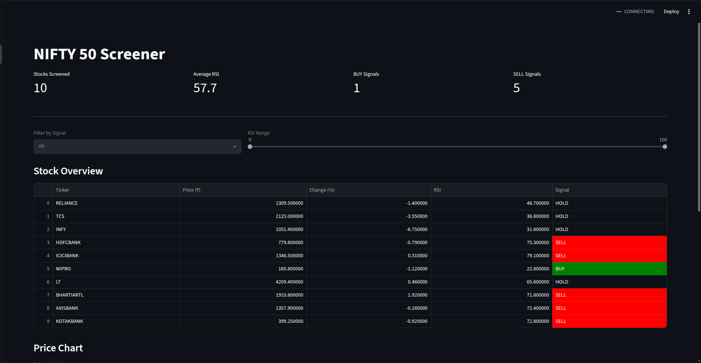

# 📈 NIFTY 50 Stock Screener

A Python-based stock screener that analyzes NIFTY stocks using technical indicators and displays results through an interactive Streamlit dashboard.

## Features

- Live stock data from Yahoo Finance
- RSI (Relative Strength Index) calculation
- BUY / SELL / HOLD signals
- Interactive filters
- Price visualization with Plotly
- Streamlit dashboard

## Tech Stack

- Python
- Streamlit
- Pandas
- Plotly
- yFinance

## Installation

```bash
git clone https://github.com/lightning9569/nifty-stock-screener.git

cd nifty-stock-screener

pip install -r requirements.txt

streamlit run app.py
```

## Current Dashboard

Dashboard showing:
- Stock prices
- RSI values
- Trading signals
- Interactive filtering

## Future Improvements

- Full NIFTY 50 coverage
- Moving Averages (20DMA, 50DMA, 200DMA)
- Candlestick charts
- Telegram alerts
- Portfolio tracker
- Backtesting engine

## Author

Gorang Chauhan
IIT Roorkee | Electronics and Communication Engineering